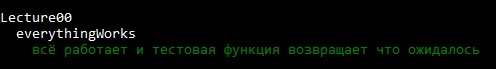

# urfu-fp-intro-20

Спецкурс "Введение в функциональное программирование" в УрФУ в 2020.

# Подготовка среды

## Установите Haskell

### MacOS

https://www.haskell.org/platform/mac.html или

```
brew install ghc cabal-install
```
Также добавьте `.cabal/bin` в `PATH`:
```
export PATH=$PATH:~/.cabal/bin
```
### Linux

https://www.haskell.org/downloads/linux/

### Windows

https://www.haskell.org/platform/windows.html.

## Проверьте, что всё работает

Проверьте, что установлен компилятор `ghc >= 8.2`

```
ghc --version
The Glorious Glasgow Haskell Compilation System, version 8.8.1
```

Чтобы убедиться, что всё установлено верно, запустите тест:

```
cd urfu-fp-intro-20
cabal update
cabal new-run spec -- --match "Lecture00"
```

Вы должны увидеть, что "всё работает":



По любым вопросам можно обратиться к официальной [документации](https://www.haskell.org/documentation/) или к преподавателям в чате [https://teleg.run/urfu_fp_intro_20_chat](https://teleg.run/urfu_fp_intro_20_chat).

## Среда разработки

Курс рассчитан на использование редактора с подсветкой кода и терминалом.

При желании можно настроить среду разработки для подсветки типов в редакторе. На это потребуется время и не факт, что все получится, поэтому это опционально.

Для Haskell есть интеграции с разными редакторами, но большинство использует [GHC IDE](https://github.com/digital-asset/ghcide). Пока нет скриптов для установки, поэтому нужно собирать ее вручную, что тоже описано в доке.

Важно — перед установкой выполните команду `cabal update`, чтобы подгрузить информацию о доступных пакетах.
После успешной установки `ghcide` нужно поставить [плагин в VS Code](https://marketplace.visualstudio.com/items?itemName=DigitalAssetHoldingsLLC.ghcide) или нужный редактор.

Про IntelliJ IDEA: для IDE от Jetbrains есть плагин для Хаскеля, но он рассчитан на работу со Stack — другим менеджером пакетов, обратите внимание.

# Как решать задачи

Материалы занятий можно найти в `src/Lecture*.hs`. В каждом занятии есть материал для изучения и задачи, которые нужно решить.

### GHCI

Для экспериментов вам пригодится интерактивная среда Haskell — `GHCI`. Узнать о ней подробнее можно на странице [документации](https://downloads.haskell.org/~ghc/latest/docs/html/users_guide/ghci.html). Чтобы выйти из `GHCI` используйте команду `:quit`.

Многострочные определение задаются при помощи `:{` и `:}`:

```
:{
hello name = if name == "John"
  then "hello john!"
  else "i don't know you"
:}
```

### Запуск тестов

Чтобы проверить своё решение нужно запустить тесты с помощью `cabal`. Например, для запуска тестов третьей лекции нужно выполнить команду:

```
cabal new-run spec -- --match "Lecture03"
```

### Загрузка модуля

Чтобы проверить, что у вас получилось, не запуская тесты, можно загрузить модуль очередного занятия в `ghci`. Например, модуль первого занятия можно загрузить с помощью команды:

```
ghci src/Lecture01.hs
```

Если вы внесли какие-то изменения, то нужно обновить модуль в `ghci` с помощью команды `reload`:

```
:reload Lecture01
```

или просто

```
:r Lecture01
```

# Как сдавать задачи

Для сдачи задач вам потребуются базовые навыки работы с `git`. 
Если до этого вы с ним не работали, можете изучить материалы из [kontur-courses/git](https://github.com/kontur-courses/git).

### Запустите тесты
Убедитесь, что у вас проходят все тесты к лекции. [Здесь](https://github.com/ak3n/urfu-fp-intro-20#%D0%B7%D0%B0%D0%BF%D1%83%D1%81%D0%BA-%D1%82%D0%B5%D1%81%D1%82%D0%BE%D0%B2) посмотрите, как их запустить.

### Отправьте pull request

Создайте отдельную ветку, закоммитив изменения:

```
git checkout -b lecture01
git add src/Lecture01.hs
git commit -m "add lecture01"
```

Создайте fork этого репозитория и запушайте в него свои изменения:

```
git remote add fork git@github.com:<ваш_юзернейм>/urfu-fp-intro-20.git 
git push fork lecture01
```

Fork репозитория достаточно сделать только один раз перед сдачей первой задачи.

После этого создайте pull request, указав ваши имя и фамилию. Если вы делали задания в паре, укажите имена и фамилии обоих.<br/>
Поздравляю, вы великолепны. 👌 

# Расписание

Неделя | Дата   | Тема 
-------|--------|------
1      | 27 фев | Введение в Haskell
2      | 05 мар | Списки и строки
3      | 12 мар | Лямбда-исчисление (untyped/stlc)
4      | 19 мар | ADTs
5      | 26 мар | Ленивость
6      | 02 апр | 💤
7      | 09 апр | Параметрический полиморфизм
8      | 16 апр | Классы типов
9      | 23 апр | Структуры данных
10     | 30 апр | Монады IO и Random
11     | 07 мая | Остальные монады
12     | 14 мая | Трансформеры
13     | 21 мая | Архитектура функциональных приложений
14     | 28 мая | Type-level programming

# Спонсоры

Курс проводится при поддержке компании [Typeable](http://typeable.io) и компании [СКБ Контур](https://kontur.ru/).
